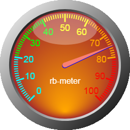

# rb-meter

A HTML5 Canvas dashboard speedometer component for Angular.



## Installation

To install this library, run:

```bash
$ npm install rb-meter --save
```

## Consuming RbMeterModule

From your Angular `AppModule`:

```typescript
import { BrowserModule } from '@angular/platform-browser';
import { NgModule } from '@angular/core';

import { AppComponent } from './app.component';

// Import RbMeterModule library
import { RbMeterModule } from 'rb-meter';

@NgModule({
  declarations: [
    AppComponent
  ],
  imports: [
    BrowserModule,

    // Specify RbMeterModule as an import
    RbMeterModule
  ],
  providers: [],
  bootstrap: [AppComponent]
})
export class AppModule { }
```

Once RbMeterModule is imported, you can use its components, directives and pipes in your Angular application:

```xml
<!-- You can now use RbMeterComponent in app.component.html -->
<h1>
  {{title}}
</h1>
<rb-meter width="256" height="256" [config]="{value: 75}"></rb-meter>
```

## RbMeterConfig

```typescript
export declare const RbMeterConfig: {
    value: number;
    minValue: number;
    maxValue: number;
    tickStartAngle: number;
    tickEndAngle: number;
    majorDivisions: number;
    minorDivisions: number;
    majorTickWidth: number;
    majorTickLength: number;
    majorTickPadding: number;
    minorTickWidth: number;
    minorTickLength: number;
    minorTickPadding: number;
    digitDecimalPlaces: number;
    digitFontName: string;
    digitFontHeight: number;
    digitPadding: number;
    units: string;
    unitsColor: string;
    unitsFont: string;
    unitsPadding: number;
    ringGradientColorStop0: string;
    ringGradientColorStop1: string;
    ringWidthPercent: number;
    bevelWidthPercent: number;
    backgroundGradientYPercent: number;
    backgroundGradientColorStop0Ranges: {
        maxValue: number;
        color: string;
    }[];
    backgroundGradientColorStop1Ranges: {
        maxValue: number;
        color: string;
    }[];
    tickColorRanges: {
        maxValue: number;
        color: string;
    }[];
    digitColorRanges: {
        maxValue: number;
        color: string;
    }[];
    indicatorCenterDiameter: number;
    indicatorColor: string;
    indicatorShadowColor: string;
    indicatorShadowXOffset: number;
    indicatorShadowYOffset: number;
    reflectionWidthPercent: number;
    reflectionHeightPercent: number;
    reflectionColor: string;
    reflectionTransparency: number;
    reflectionPadding: number;
};
```

## License

MIT © [Robert Brower](mailto:robertbrower.technologies@gmail.com)
